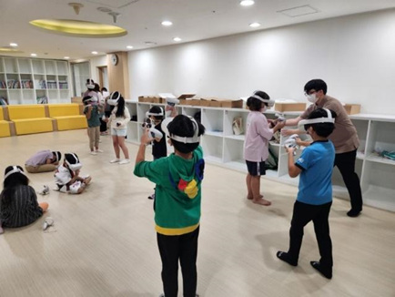
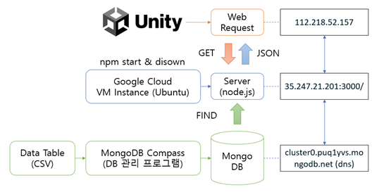
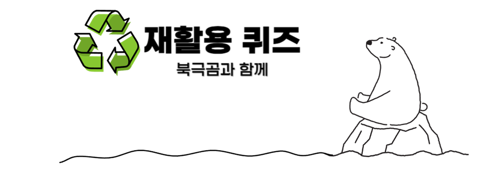

# Project Name: 북극곰과 함께
VR 기술은 현재 엔터테인먼트, 교육 등의 분야에서 다양하게 활용되고 있습니다.

그 중에서 저희는 교육 분야에서의 활용에 주목했습니다.

## 프로젝트 정보
기간: 2023.12.22 - 2024.01.09 

엔진: Unity(C#)

Back-End: Express.js(Node.js)

DB: Mongo DB

인원: 7

## 기획 의도 
세계적인 환경 파괴 문제의 위험성과 분리수거와 환경보호의 연관성을\
아이들에게 교육하는 목적으로 기획을 진행\
아이들이 이해하기 쉬운 간단한 퀴즈 방식의 컨텐츠를 활용하여 \
아이들이 보다 재미있고 간단하게 분리수거에 대해 교육을 하도록 기획한다.\
또한, 현재 발전하고 있는 VR 기술을 체험 및 활동을 통하여 VR 이라는 기술의 설명을\
부가 목적으로 설정 VR 을 활용한 콘텐츠 제작을 기획한다.\
주요 타겟은 7 - 10 세의 아이들을 겨냥하여 분리수거 교육 및 VR 기술의 이해를 목적으로
한다.
\
그림 1 . 시흥 돌봄센터 어린이 VR체험\
\
그림 2 . 어린이 선박사고 대피 VR체험\

## 아키텍처

## 시연 영상
 

## 역할 분배

|이름|직무|주 업무|보조 업무|
|------|---|---|---|
|이재호|기획|PD|포톤 프로그래밍|
|조호영|기획|PD|맵 디자인|
|김현우|기획|PD|퀴즈 기획|
|최성영|개발|시스템 프로그래밍|VR 프로그래밍|
|박현서|개발|포톤 프로그래밍|시스템 프로그래밍|
|조승현|개발|VR 프로그래밍|시스템 프로그래밍|
|이동협|개발|DB 구축|DB 프로그래밍|
